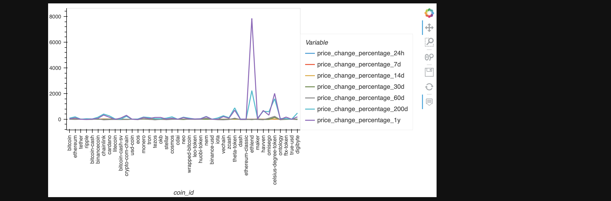
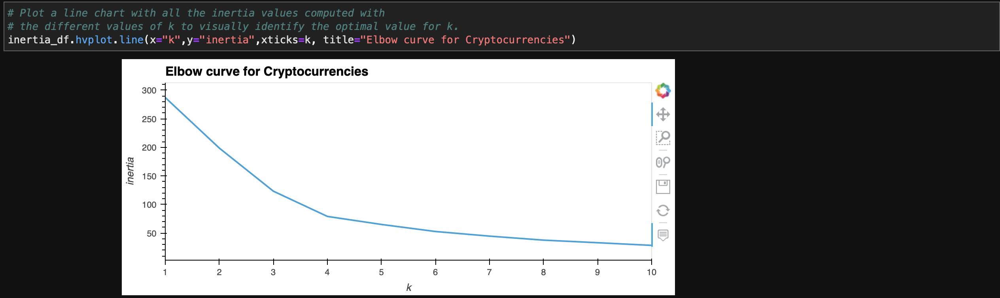
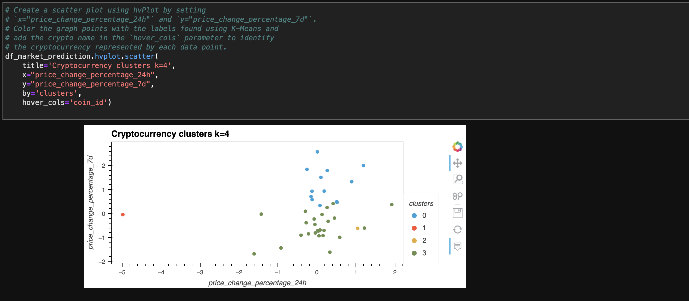
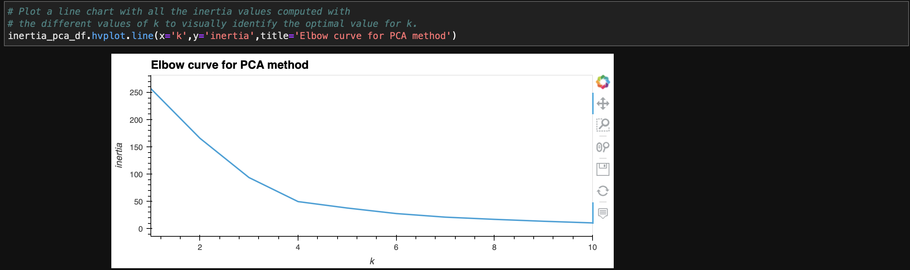
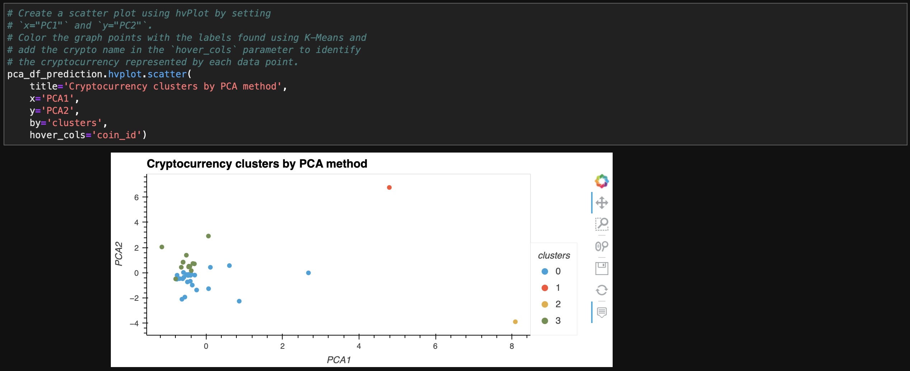

# *Crypto Portfolio*
---

**Welcome to my repository for the crypto portfolio. Please explore the codebase!** <br />

---
## Analytical Summary

This project clusters cryptocurrencies for a more unique approach to create a cryptocurrency portfolio.

---

## Technologies

This project leverages python 3.7 with the following packages:

* [pandas](https://pandas.pydata.org) - Library for reading/writing csv files and fast manipulation with DataFrames.

* [pathlib](https://docs.python.org/3/library/pathlib.html) - Library for filesystem paths.

* [hvplot.pandas](https://hvplot.holoviz.org) - A tool that is built on Holoviews, used for plotting data.

* [sklearn](https://scikit-learn.org/stable/) - Library for predictive-data analysis.
---

## Installation Guide

Before running the application first install the following dependencies.

```python

  pip install pandas
  pip install pathlib
  pip install hvplot
  pip install -U scikit-learn

```
---

## Usage

To use this project simply clone the repository and run the code **crypto_investments.ipynb** in JupyterLab or in VS Code.

---

## Methodology
This script uses unsupervised machine-learning model for clustering.
The dataset includes different frequencies of growth rates for prices:


To correctly determine the best number of clusters, the algorithm calculates the Elbow curve:



The graphical representation for four clusters of cryptocurrencies is following:



We compare the above results with the use of principal component analysis prior clustering. The PCA method allows us to reduce number of variables while keeping their common variance for clustering.
The Elbow curve for the dataset with principal components is:


The visualization of the clusters by using the PCA method:


---

## License

MIT

---


 
